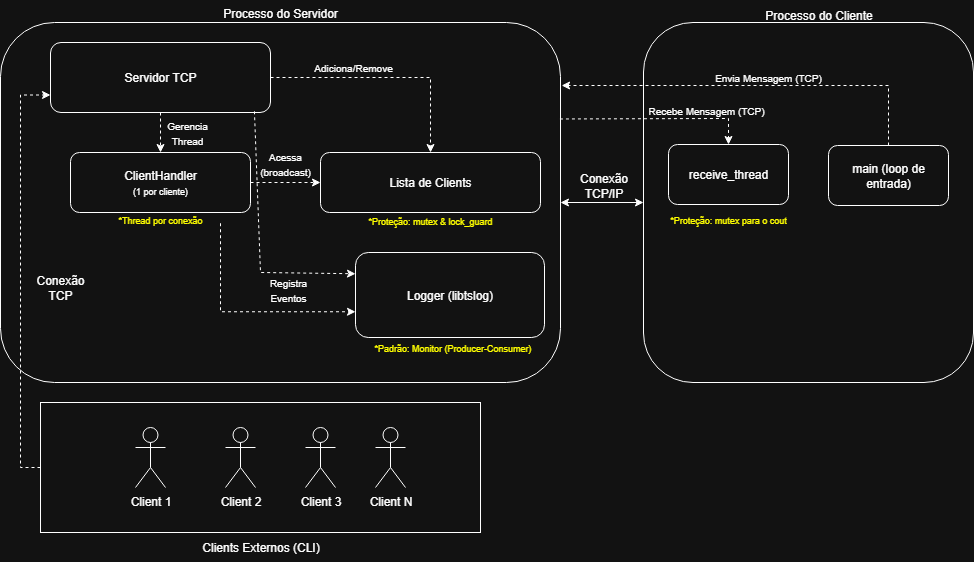

# Relatório Final - Servidor de Chat Multiusuário TCP

**Disciplina:** Linguagem de Programação II  
**Aluno:** Arthur Maximus Cavalcante Beuttenmuller  
**Matrícula:** 20230047417  
**Data:** 05 de Outubro de 2025

## 1. Introdução

Com a proposta de desenvolver um Servidor de Chat Multiusuário TCP, este relatório descreve o processo de criação, identificação de falhas, testes, integração do sistema e o devido uso da inteligência artificial (IA) em todo o processo. O sistema foi realizado em um total de 3 etapas.  

### 1.1 Sistema

O sistema possui:

- Servidor TCP concorrente aceitando múltiplos clientes
- Cada cliente atendido por thread
- Mensagens retransmitidas para os demais clientes (broadcast)
- Logging concorrente de mensagens
- Cliente CLI: conecta, envia e recebe mensagens
- Histórico de mensagens thread-safe (monitor)
- Entre outros

### 1.2 Visão Geral da Arquitetura do sistema

A imagem a seguir mostra o diagrama de arquitetura da aplicação:



*Figura 1: Arquitetura Lógica e Padrões de Concorrência do Sistema de Chat.*

### 1.3 Mapeamento de Requisitos para o Código

Esta seção mapeia os requisitos obrigatórios do projeto, tanto os gerais quanto os específicos do Tema A, para as partes correspondentes no código-fonte.

| Requisito do Projeto | Arquivo(s) e Função/Classe Principal | Descrição da Implementação |
| :--- | :--- | :--- |
| **Servidor TCP concorrente** | `src/server/Server.cpp` (nas funções `start` e `acceptClients`) | O servidor cria um socket TCP, faz o `bind` e `listen` na porta especificada, e entra em um loop para aceitar múltiplas conexões de clientes. |
| **Cada cliente atendido por thread** | `src/server/Server.cpp` (função `acceptClients`) e `src/server/ClientHandler.cpp` (função `start`) | Para cada cliente aceito, uma instância de `ClientHandler` é criada e sua função `start()` lança uma `std::thread` dedicada que executa `handleMessages`. |
| **Broadcasting de mensagens** | `src/server/Server.cpp` (função `broadcastMessage`) | Uma mensagem recebida de um cliente é retransmitida para todos os outros clientes conectados na lista, exceto o remetente original. |
| **Proteção de estruturas compartilhadas** | `src/server/Server.cpp` (funções `acceptClients`, `broadcastMessage`, `removeClient`) | A lista de clientes (`std::vector<... > clients`) é protegida em todas as operações de leitura e escrita por um `std::mutex` (`clients_mutex`) através de `std::lock_guard`. |
| **Logging concorrente** | `src/logger/` (`Logger.hpp`, `Logger.cpp`) e uso em todo o projeto. | A biblioteca `libtslog` foi implementada como uma classe Singleton que usa o padrão Monitor (Produtor-Consumidor) para garantir o logging seguro a partir de múltiplas threads. |
| **Cliente CLI** | `src/client/client.cpp` | Uma aplicação de terminal que se conecta ao servidor, usa uma thread para receber mensagens e a thread principal para ler a entrada do usuário e enviar mensagens. |
| **Uso de `std::thread`** | `Logger.cpp`, `Server.cpp`, `ClientHandler.cpp`, `client.cpp` | `std::thread` é usado extensivamente para a thread do logger, a thread de aceitação de conexões, a thread de cada cliente e a thread de recebimento do cliente. |
| **Exclusão Mútua** | `Logger.cpp`, `Server.cpp` | `std::mutex` é usado para proteger a fila de logs (`Logger`) e a lista de clientes (`Server`). |
| **Variáveis de Condição** | `src/logger/Logger.cpp` (classe `Logger`) | `std::condition_variable` é usada para sincronizar a thread produtora (que chama `log`) e a consumidora (a `writer_thread`), permitindo que a consumidora "durma" eficientemente. |
| **Monitores** | `src/logger/Logger.cpp` (classe `Logger`) | A classe `Logger` encapsula o recurso compartilhado (a fila), o mutex e a variável de condição, expondo uma interface pública thread-safe, caracterizando um Monitor. |
| **Sockets** | `Server.cpp`, `ClientHandler.cpp`, `client.cpp` | Uso completo da API de Sockets POSIX para `socket()`, `bind()`, `listen()`, `accept()`, `connect()`, `send()` e `recv()`. |
| **Gerenciamento de Recursos (RAII)** | `Server.cpp`, `ClientHandler.cpp` | `std::shared_ptr` gerencia o ciclo de vida dos objetos `ClientHandler`. `std::lock_guard` garante a liberação de mutexes. |
| **Tratamento de Erros** | `Server.cpp` (função `start`), `server_main.cpp` | A inicialização do servidor lança `std::runtime_error` em caso de falha de rede. O `main` do servidor e do cliente usam blocos `try-catch` para capturar exceções. |
| **Build com `Makefile`** | `Makefile` (na raiz do projeto) | Um `Makefile` foi criado para compilar os múltiplos alvos (servidor, cliente, testes) e gerenciar a estrutura de diretórios do projeto. |


## 2. Relatório de Análise de Concorrência com Auxílio de IA

Este projeto foi desenvolvido com o auxílio contínuo de uma ferramenta de IA (Gemini) em cada uma de suas três etapas. A análise a seguir está organizada cronologicamente para demonstrar como a colaboração com a IA evoluiu junto com o projeto, desde o design inicial até a correção de bugs complexos.

### 2.1 Análise na Etapa 1: Design do Logger Thread-Safe

Nesta etapa, o objetivo era a "Implementação da biblioteca de logging thread-safe". A IA foi utilizada de forma **proativa** para definir uma arquitetura robusta desde o início.

* **Contexto:** Era necessário criar uma biblioteca de log que pudesse ser chamada por múltiplas threads simultaneamente sem corromper o arquivo de saída.
* **Interação com a IA (Prompt Utilizado):** A consulta durante a fase de design foi equivalente a: *"Qual é a melhor arquitetura para um logger concorrente em C++ que seja eficiente e seguro contra race conditions?"*
* **Análise e Sugestão da IA:** A IA recomendou a implementação do padrão de design **Monitor** na forma de um **Produtor-Consumidor**. A sugestão foi criar uma classe `Logger` que gerencia uma fila de mensagens (`std::queue`) protegida por um `std::mutex`. As threads da aplicação (produtoras) apenas adicionariam mensagens à fila (uma operação rápida), enquanto uma única thread dedicada (consumidora) seria responsável por retirar as mensagens da fila e escrevê-las no disco. A sincronização entre elas seria feita com uma `std::condition_variable` para evitar esperas ativas (`busy-waiting`), garantindo alta eficiência.
* **Resultado:** A biblioteca `libtslog` foi implementada seguindo  este padrão. O resultado foi uma base de logging robusta e desacoplada, que se provou essencial nas etapas seguintes e cumpriu o requisito de encapsular sincronização em classes.

### 2.2 Análise na Etapa 2: Protótipo Funcional e Correção de Bugs

Nesta etapa, o foco era criar um "protótipo CLI com comunicação básica". Aqui, a IA foi usada tanto para prevenção de problemas quanto para a depuração de bugs.

#### Caso 1: Prevenção de Condição de Corrida na Lista de Clientes (Design Proativo)

* **Contexto:** Durante o design da classe `Server`, foi identificado que o vetor `clients` seria um recurso compartilhado acessado por múltiplas threads, criando um risco claro de condição de corrida, conforme o requisito de "Proteção de estruturas compartilhadas".
* **Interação com a IA:** Durante a criação do `Server.hpp`, a discussão foi sobre como garantir o acesso seguro à lista de clientes.
* **Análise e Sugestão da IA:** A IA sugeriu a inclusão imediata de um `std::mutex` na classe `Server` para proteger o vetor. Para a implementação, foi recomendada a utilização de `std::lock_guard` no escopo de todas as funções que acessassem a lista (`acceptClients`, `broadcastMessage`, `removeClient`). Esta abordagem foi sugerida por ser compatível com o princípio RAII, garantindo segurança mesmo em caso de exceções.
* **Resultado:** A proteção foi implementada conforme sugerido, prevenindo preventivamente uma classe inteira de bugs de concorrência.

#### Caso 2: Correção de Deadlock na Desconexão

* **Contexto:** O problema mais crítico do projeto foi descoberto durante os testes manuais da Etapa 2. O servidor travava e era abortado pelo sistema com a mensagem `Resource deadlock avoided` sempre que um cliente se desconectava.
* **Prompt Utilizado:** 
    > "terminate called after throwing an instance of 'std::system_error' what(): Resource deadlock avoided. Esse problema é normal? Estou recebendo quando dou /quit no cliente"
* **Análise e Sugestão da IA:** A IA diagnosticou um deadlock clássico de "auto-join". Foi explicado que a thread do `ClientHandler` estava, através de uma cadeia de chamadas (`handleMessages` → `removeClient` → `~ClientHandler`), tentando executar `join()` em si mesma, uma operação impossível. A solução proposta foi desacoplar a thread de seu objeto `ClientHandler` usando o método `detach()` no momento da criação da thread e remover a chamada `join()` do destrutor.
* **Resultado:** O bug foi completamente resolvido ao aplicar a sugestão no arquivo `ClientHandler.cpp`. O servidor se tornou estável e robusto contra a desconexão de clientes, um requisito fundamental para o sistema.

### 2.3 Análise na Etapa 3: Finalização e Documentação

* **Contexto:** O objetivo desta etapa é a entrega do "sistema completo com cliente/servidor funcionando" e a elaboração do relatório final.
* **Interação com a IA:** O papel da IA nesta fase consistiu em melhorias de qualidade do sistema e auxilío na documentação dos prompts utilizados.
* **Resultado:** A IA auxiliou na organização dos artefatos de documentação, garantindo que o relatório final fosse abrangente e refletisse o trabalho de desenvolvimento e depuração realizado.

## 3. Evidências de Código (Problemas Reais e Potenciais)

Esta seção apresenta os trechos de código para os problemas de concorrência e protocolo discutidos na Seção 2, bem como outros cenários de erro analisados.

### 3.1 Prevenção de Condição de Corrida na Lista de Clientes

#### Código Problemático (Hipotético)
```cpp
// Esta versão NUNCA foi implementada, mas ilustra o problema.
void Server::broadcastMessage(const std::string& message, int sender_socket) {
    // PERIGO: Iterar e acessar o vetor sem lock é uma race condition.
    for (const auto& client : clients) {
        if (client->getSocket() != sender_socket) {
            client->sendMessage(message);
        }
    }
}
````

#### Código Corrigido (Implementado)

```cpp
void Server::broadcastMessage(const std::string& message, int sender_socket) {
    // SOLUÇÃO: std::lock_guard protege o acesso durante todo o escopo da função.
    std::lock_guard<std::mutex> lock(clients_mutex);
    // ... lógica de broadcast ...
}
```

### 3.2 Correção de Deadlock na Desconexão do Cliente 

#### Código Problemático (Versão Anterior)

```cpp
// Em ClientHandler.cpp
ClientHandler::~ClientHandler() {
    is_running = false;
    if (handler_thread.joinable()) {
        // BUG: A thread tenta esperar por si mesma aqui, causando deadlock.
        handler_thread.join();
    }
    close(client_socket);
}
```

#### Código Corrigido (Versão Implementada)

```cpp
// Em ClientHandler.cpp

// 1. A thread é desacoplada na sua criação.
void ClientHandler::start() {
    is_running = true;
    handler_thread = std::thread(&ClientHandler::handleMessages, this);
    handler_thread.detach(); // SOLUÇÃO
}

// 2. O join() é removido do destrutor.
ClientHandler::~ClientHandler() {
    close(client_socket);
    // ...
}
```

### 3.3 Problema de Protocolo: Framing de Mensagens TCP (Erro Possível)

O protocolo TCP é orientado a fluxo, não a mensagens. Isso significa que duas mensagens enviadas rapidamente poderiam ser lidas por um único `recv`, aparecendo "coladas" no terminal do cliente.

#### Código Problemático (Implementação ingênua do cliente)

```cpp
// Em client.cpp
void receiveMessages(int client_socket) {
    char buffer[4096];
    while (keep_running) {
        int bytes_received = recv(client_socket, buffer, sizeof(buffer), 0);
        if (bytes_received > 0) {
            // PROBLEMA: Se o buffer contiver "msg1\nmsg2\n", imprimirá tudo de uma vez.
            std::cout << std::string(buffer, bytes_received);
        }
        // ...
    }
}
```

#### Código Corrigido (Implementação com delimitador)

A solução envolve duas partes: garantir que o servidor sempre envie um delimitador (como `\n`) e fazer o cliente acumular dados e processar apenas mensagens completas.

```cpp
// 1. Servidor garante o delimitador (já implementado em ClientHandler.cpp)
void ClientHandler::sendMessage(const std::string& message) {
    std::string formatted_message = message + "\n"; // Garante o \n
    send(client_socket, formatted_message.c_str(), formatted_message.length(), 0);
}

// 2. Cliente processa o buffer acumulado
void receiveMessages(int client_socket) {
    std::string buffer_acumulado;
    char buffer_leitura[4096];
    while (keep_running) {
        int bytes_received = recv(client_socket, buffer_leitura, sizeof(buffer_leitura), 0);
        if (bytes_received > 0) {
            buffer_acumulado.append(buffer_leitura, bytes_received);
            size_t pos;
            // Processa todas as mensagens completas (terminadas em \n) que estão no buffer.
            while ((pos = buffer_acumulado.find('\n')) != std::string::npos) {
                std::string mensagem_completa = buffer_acumulado.substr(0, pos);
                std::cout << mensagem_completa << std::endl;
                buffer_acumulado.erase(0, pos + 1);
            }
        }
        // ...
    }
}
```

### 3.4 Condição de Corrida na Saída do Cliente

O objeto `std::cout` não é thread-safe. No nosso cliente, a thread principal (que pode mostrar erros) e a `receiver_thread` (que mostra mensagens) escrevem no `std::cout` sem sincronização, o que poderia gerar saídas de texto intercaladas e confusas.

#### Código Problemático

```cpp
// Em client.cpp
void receiveMessages(int sock) {
    //...
    std::cout << "Mensagem recebida..." << std::endl; // Acesso 1
}

int main(...) {
    //...
    std::cerr << "Falha ao enviar mensagem." << std::endl; // Acesso 2
}
```

#### Código Corrigido

```cpp
// Em client.cpp
#include <mutex>

static std::mutex cout_mutex; // Mutex global para proteger o std::cout

void receiveMessages(int sock) {
    //...
    {
        std::lock_guard<std::mutex> lock(cout_mutex);
        std::cout << "Mensagem recebida..." << std::endl;
    }
}

int main(...) {
    //...
    {
        std::lock_guard<std::mutex> lock(cout_mutex);
        std::cerr << "Falha ao enviar mensagem." << std::endl;
    }
}
```
## 4. Testes de Validação

Para validar a robustez e a correção do sistema, foram realizados testes focados em simular o uso concorrente e verificar a integridade dos dados e logs.

### 4.1 Teste de Estresse (Simulação de Múltiplos Clientes)

O principal teste de validação consistiu em um teste de estresse para simular um cenário de uso real com múltiplos clientes interagindo simultaneamente com o servidor.

* **Metodologia:**
    1.  O servidor foi iniciado em um terminal (`./bin/chat_server 8080`).
    2.  O script `start_clients.sh` foi executado para iniciar 3 clientes concorrentes em terminais separados.
    3.  Mensagens foram enviadas de cada cliente para verificar a funcionalidade de broadcast e a estabilidade do servidor sob carga.
    4.  Testes com o comando `/quit` foram utilizados para verificar à desconexão no servidor (cenário que antes causava o deadlock).

* **Resultados Observados:**
    * **Conexões:** O servidor aceitou com sucesso as 3 conexões simultâneas.
    * **Comunicação:** As mensagens enviadas por cada cliente foram corretamente recebidas por todos os outros, com o prefixo de identificação (`[Cliente X]:`).
    * **Condições de Corrida:** Nenhuma mensagem apareceu corrompida, cortada ou intercalada, validando a eficácia dos mutexes no servidor e no logger.
    * **Deadlocks:** O servidor permaneceu 100% estável durante a desconexão de clientes, confirmando que o bug de deadlock foi resolvido.
    * **Estabilidade:** O sistema permaneceu estável durante todo o teste, sem travamentos ou comportamento inesperado.

### 4.2 Análise dos Logs

Após a execução do teste de estresse, o arquivo de log gerado pelo servidor (`server_log.txt`) foi inspecionado manualmente para uma análise qualitativa.

* **Metodologia:** Verificação do arquivo de log em busca de inconsistências ou erros após o término do teste.

* **Resultados Observados:**
    * **Ordenação Temporal:** As mensagens no log apareceram em ordem cronológica correta, com timestamps consistentes.
    * **Completude:** Todos os eventos importantes foram registrados: início do servidor, conexão de cada cliente (com seu IP), mensagens recebidas, broadcast realizado e desconexão de clientes.
    * **Integridade:** Não houve intercalação de caracteres ou linhas de log corrompidas, validando a implementação thread-safe da biblioteca `libtslog`.

## 5. Lições Aprendidas na Colaboração Humano-IA

A utilização de uma ferramenta de IA como assistente de programação foi um dos pilares deste projeto. A experiência revelou tanto os pontos fortes quanto suas limitações.

### 5.1 Eficácia da IA: Pontos Fortes

A IA demonstrou ser uma ferramenta extremamente eficaz para acelerar o desenvolvimento e aumentar a qualidade do código, principalmente nas seguintes áreas:

* **Implementação Rápida de Padrões de Design:** Para problemas clássicos de concorrência, a IA foi capaz de fornecer implementações completas de padrões de design, como o **Monitor (Produtor-Consumidor)** para a biblioteca de logging e o uso de **RAII** com `std::lock_guard` para garantir a liberação de mutexes.
* **Diagnóstico de Causa Raiz:** No caso do bug de deadlock, a IA foi fundamental. Dado o sintoma (o erro `Resource deadlock avoided`), ela conseguiu analisar o fluxo de execução e identificar a causa raiz teórica (o "auto-join" da thread), algo que seria muito mais demorado de depurar manualmente.
* **Geração de Código Idiomático:** A IA consistentemente sugeriu o uso de práticas de C++ moderno (`std::shared_ptr`, `std::make_shared`), elevando a qualidade e a segurança do código, prevenindo vazamentos de memória e recursos.
* **Assistência na Documentação e Estruturação:** A ferramenta foi muito útil na fase final para organizar a estrutura do `Makefile` e do `README.md`.

### 5.2 Limitações da IA

Apesar dos pontos fortes, a experiência também deixou claras as limitações da tecnologia no seu estado atual:

* **Falta de Descoberta Proativa de Bugs:** O bug de deadlock não foi previsto pela IA durante a fase de design. Ele só foi descoberto através de **testes manuais**.
* **Dependência do Contexto Fornecido:** A qualidade da análise da IA é diretamente proporcional à qualidade do prompt. Para diagnosticar o deadlock, foi necessário o sintoma exato e o cenário que o causava. A IA não possui o contexto completo do projeto e não pode "testar" o código por conta própria.
* **Generalidade das Soluções:** Nem sempre as propostas de soluções realizadas pela IA foram eficazes, portanto foi necessário análises e testes individuais para validar o que a IA estava sugerindo.

### 5.3 Interação Humano-IA

A lição mais importante é entender que a IA é uma **ferramenta de aumento de capacidade**. O modelo de colaboração mais eficaz que emergiu foi o seguinte:

1.  **Humano:** Atua como o **arquiteto e o testador**. Definindo a estrutura, código inicial e realiza testes práticos para encontrar os problemas reais.
2.  **IA:** Atua como um **consultor e analista**. Dado um sintoma claro, a IA é capaz de diagnosticar a causa raiz teórica e fornecer uma solução canônica.
3.  **Humano:** Atua como o **integrador e validador**. Dado a sugestão da IA, realiza-se a adaptação ao contexto específico do projeto, implementando a correção e, crucialmente, **valida** através de novos testes que o problema foi de fato resolvido.

Este ciclo de `Testar -> Consultar -> Implementar -> Validar` demonstrou ser a forma mais eficiente de construir o projeto.

## 6. Conclusão

O desenvolvimento do servidor de chat TCP concorrente foi concluído com sucesso, cumprindo todos os requisitos obrigatórios de funcionalidade, concorrência e qualidade de código. O projeto serviu como uma demonstração prática dos desafios envolvidos na criação de sistemas multi-threaded.

A utilização de uma IA (Gemini) como assistente de desenvolvimento se provou uma estratégia valiosa, não como uma substituta para o desenvolvedor, mas como uma ferramenta poderosa que aumenta a produtividade e a profundidade da análise técnica.

Em resumo, a colaboração ao longo do projeto demonstrou que:

* **A IA foi particularmente eficaz para:**
    1.  **Sugerir Soluções Padrão:** Fornecer implementações canônicas e seguras de padrões de design complexos, como o Monitor (Produtor-Consumidor) para o logger.
    2.  **Diagnosticar Erros Teóricos:** Identificar a causa raiz de bugs de concorrência sutis, como o deadlock de "auto-join", a partir dos sintomas fornecidos.
    3.  **Gerar Código Moderno:** Produzir trechos de código que seguem as melhores práticas de C++ moderno, incluindo RAII e o uso correto de smart pointers.

* **Porém, a experiência humana foi essencial para:**
    1.  **Descobrir Bugs na Prática:** Identificar falhas, como o deadlock na desconexão, através de testes manuais e da observação do comportamento real do sistema.
    2.  **Fornecer Contexto Crítico:** Fazer as perguntas corretas e descrever os problemas de forma precisa para que a IA pudesse realizar uma análise útil.
    3.  **Tomar a Decisão Final:** Adaptar, simplificar e validar as soluções propostas pela IA, garantindo que elas se encaixassem corretamente na arquitetura geral do projeto.

**Recomendação:** A principal recomendação derivada deste projeto é a utilização da IA como um "parceiro de programação" em um ciclo iterativo. O desenvolvedor deve manter o papel central de arquiteto, testador e validador, enquanto utiliza a IA como uma ferramenta de consulta para acelerar a solução de problemas e garantir a aplicação de boas práticas.

## 7. Extra: Demonstração em Vídeo

Para complementar este relatório, um vídeo curto foi gravado para demonstrar o sistema de chat em funcionamento. O vídeo ilustra os seguintes cenários:

* Início do servidor.
* Conexão de múltiplos clientes manuais.
* Conexão de um cliente-robô (`bot.sh`) que envia mensagens automáticas.
* A comunicação (broadcast) ocorrendo entre todos os clientes.
* A desconexão de um cliente e a estabilidade contínua do servidor.

**Link do Vídeo:** `https://youtu.be/pN5Hb6fvhfk`

## 8. Referências

* **Código Fonte:** `https://github.com/Maximusthr/LP2---Servidor-de-Chat-` (tag: `v3-final`)
* **Ferramenta de IA:** Gemini (Google)
* **Material de Referência:**
    * Enunciado do Projeto Final de Programação Concorrente (LPII, UFPB)
    * Notas de aula da disciplina de LPII (Google Drive)