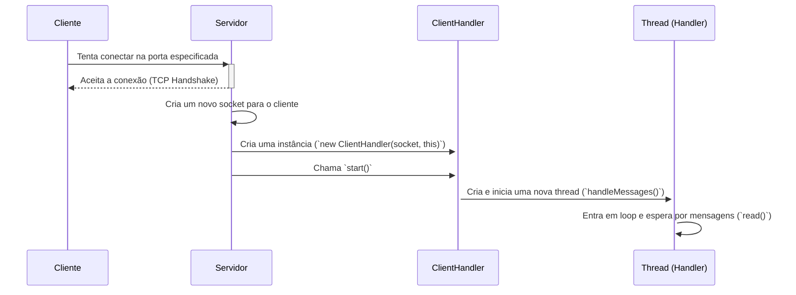

# Arquitetura do Sistema de Chat (Etapa 1)

Este documento descreve a arquitetura inicial e o fluxo de comunicação do servidor de chat.

## Cabeçalhos Principais

O projeto é composto pelas seguintes classes principais:

- **`Logger`**: Uma biblioteca thread-safe para registro de eventos.
- **`Server`**: A classe principal que gerencia conexões e o broadcast de mensagens.
- **`ClientHandler`**: Uma classe para gerenciar a comunicação com um único cliente em uma thread dedicada.

## Diagrama de Sequência

O diagrama abaixo ilustra a interação entre os componentes do sistema.

### Cenário 1: Conexão de um novo cliente



### Cenário 2: Envio e Broadcast de Mensagem

```mermaid
sequenceDiagram
    participant Cliente A
    participant Handler A
    participant Servidor
    participant Handler B
    participant Cliente B

    Cliente A->>+Handler A: Envia mensagem de texto ("Olá, mundo!")
    Handler A-->>-Cliente A: (read() desbloqueia)
    
    Handler A->>+Servidor: Chama `broadcastMessage("Olá, mundo!", socket_A)`
    
    Servidor->>Servidor: Bloqueia o mutex da lista de clientes
    Servidor->>+Handler B: Chama `sendMessage("Olá, mundo!")`
    Handler B->>+Cliente B: Escreve a mensagem no socket do Cliente B
    Cliente B-->>-Handler B: (Mensagem recebida)
    Servidor-->>-Handler B: Retorna
    
    Servidor->>Servidor: Desbloqueia o mutex
    Servidor-->>-Handler A: Retorna
```